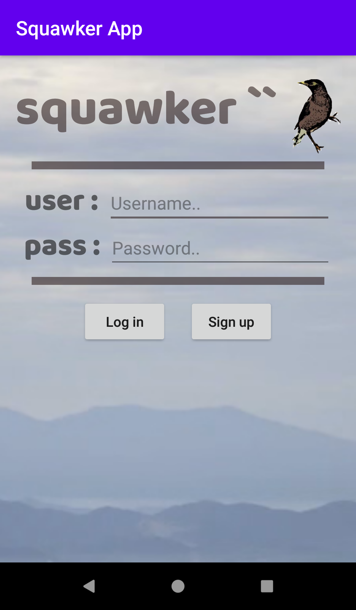
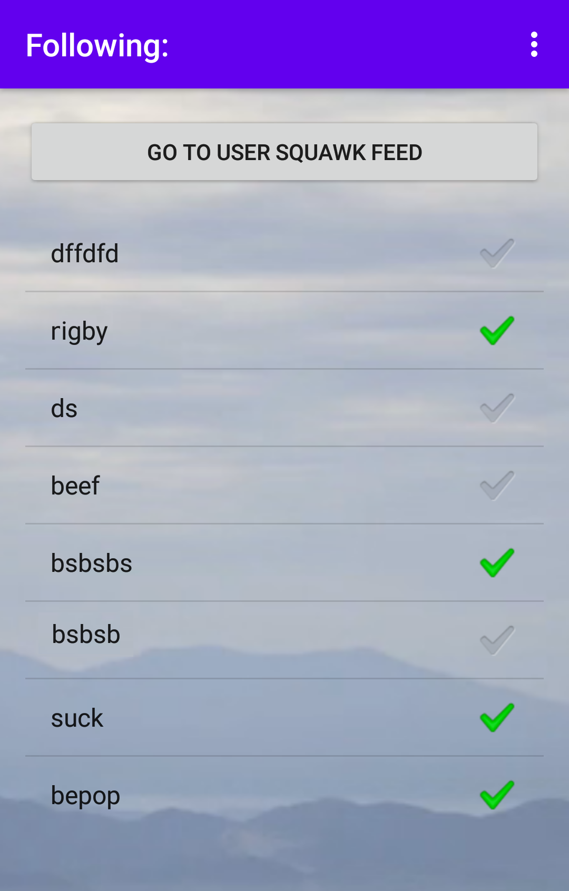
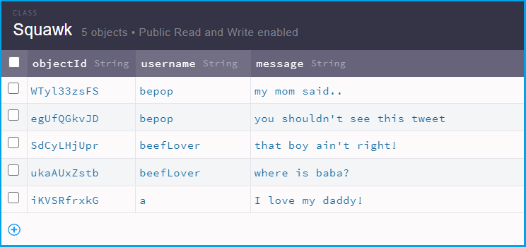

# Squawker Android App (Twitter Clone)

**Squawker** is an android app that mimics most of the major functionalities of twitter, such as: account creation, log in, following users, creating tweets and viewing Squawk (tweet) feed. 
 
#
App Screenshots:

  &nbsp
  

Squawk Database Screenshot:

  

